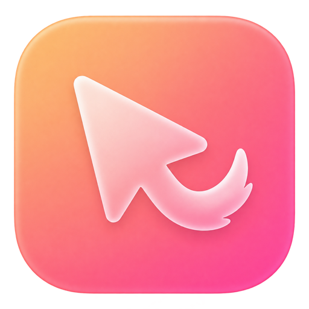

  

  

<h1 align="center">JigTail</h1>

  <b>Keeps your Mac awake, but only when it actually needs to.</b>

  A free menu bar app for macOS. It waits until you step away, then moves the pointer a
  couple of points every 40 seconds so your Mac doesn't lock, dim or fall asleep halfway
  through a long export, download or backup. Start using your Mac again and it goes back
  to waiting.

  <a href="https://github.com/pcampina/jigtail/releases/latest/download/JigTail.dmg"><b>Download for Mac</b></a>
  &nbsp;·&nbsp;
  <a href="https://pcampina.github.io/jigtail/">Website</a>

  
  
  
  
  
  
  
  

  
  

## Why JigTail

Your Mac can't tell the difference between you walking away and you waiting on a render.
After a few idle minutes it dims the display, starts the screensaver or goes to sleep, and a
long download, render or backup can stall along with it.

JigTail sits in the menu bar and covers that gap. It leaves the pointer alone while you work
and only steps in once you've really been away. If you've used Jiggler before, this does the
same job as a native app that fits in on a current Mac.

## What it does

### Waits until you're gone

Choose how long you need to be idle before it starts: 1, 5, 15, 30 or 60 minutes straight from
the popover, or anything from 1 to 120 minutes in Settings. The default is 5.

### Nudges instead of dragging

Every 40 seconds it moves the pointer two points and puts it right back. The cursor flashes for
a split second so you know it was JigTail. You can set the interval anywhere from 10 seconds to
5 minutes. Before each nudge it checks for real mouse or keyboard input, and if you're back, it
stops and waits for you to go idle again.

### Only when something is running

Switch the trigger mode to Conditional and JigTail keeps the Mac awake only while at least one
of these is true:

- an app you pick is open, like your renderer, Transmission or a local CI runner
- CPU usage is above a threshold you set (30% by default)
- Music or Spotify is playing

It checks again every 10 seconds and goes back to waiting when none of them apply.

### Shows you what it's doing

Click the menu bar icon and one knob tells you the state: off, waiting for you to go idle, or
jiggling. A ring around it counts down to the next step, so you're never guessing.

### Keeps idle sleep away

While JigTail is switched on, it also tells macOS not to idle-sleep the system, which covers the
minutes before jiggling kicks in too.

### Stays out of the way

No Dock icon. It arms itself when it launches, can start at login, and follows your system
appearance or sticks to light or dark mode.

## Install

1. Download [JigTail.dmg](https://github.com/pcampina/jigtail/releases/latest/download/JigTail.dmg)
   from the latest release.
2. Open it and drag JigTail into Applications.
3. Launch JigTail. The first time, macOS asks for Accessibility access. Turn JigTail on in
   System Settings > Privacy & Security > Accessibility, then click the knob in the menu bar
   popover to start.

JigTail is signed with a Developer ID and notarized by Apple, so it opens like any other app.
It needs macOS 13 Ventura or later on an Apple Silicon Mac.

## Privacy

JigTail never connects to the internet. There's no account, no analytics and no crash
reporting, and your settings stay in the app's local preferences on your Mac.

It asks for two permissions:

- Accessibility, to move the pointer. Without it JigTail can't do its job, so it won't turn on.
- Automation for Music and Spotify, only if you enable the "Music or Spotify is playing"
  trigger. JigTail uses it to ask those apps whether they're playing, nothing else.

## FAQ

Will it move the pointer while I'm using my Mac?

No. Before every nudge it looks at when you last used the mouse or keyboard. If that was
recent, it skips the nudge and goes back to waiting.

Does it stop my Mac from sleeping when I close the lid?

No. It only prevents idle sleep. Closing the lid or choosing Sleep from the Apple menu works
exactly as before.

Why does it need Accessibility access?

macOS only lets apps with Accessibility access post mouse events. JigTail uses it for the
two-point nudge and for nothing else.

Does it run on Intel Macs?

Not at the moment. Builds are Apple Silicon only.

How do I update?

There's no auto-updater yet. Download the latest
[JigTail.dmg](https://github.com/pcampina/jigtail/releases/latest/download/JigTail.dmg) and
replace the app in Applications. That link and the website always point to the newest build.

Is it really free?

Yes. It's open source under the MIT license, with no paid tier and nothing to unlock.

## Support JigTail

I build and maintain JigTail on my own time, and it will stay free. If it saved one of your
exports, you can [buy me a coffee](https://www.buymeacoffee.com/pcampina). A star on the repo
helps other people find it, and if something doesn't work the way you expect,
[open an issue](https://github.com/pcampina/jigtail/issues).

## Contributing

Want to build it yourself or send a fix? [CONTRIBUTING.md](CONTRIBUTING.md) covers building,
tests, how releases are made and how the code is organized.

## License

MIT. See [LICENSE](LICENSE).
