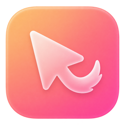
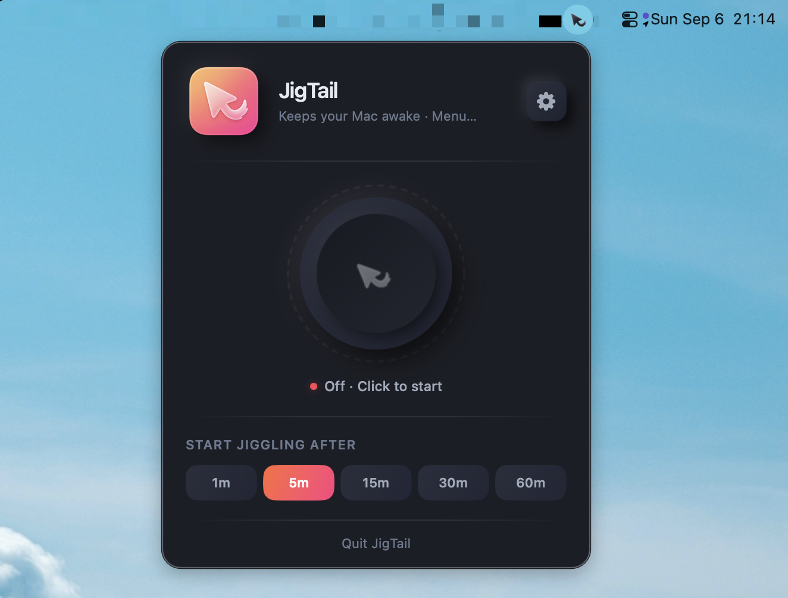
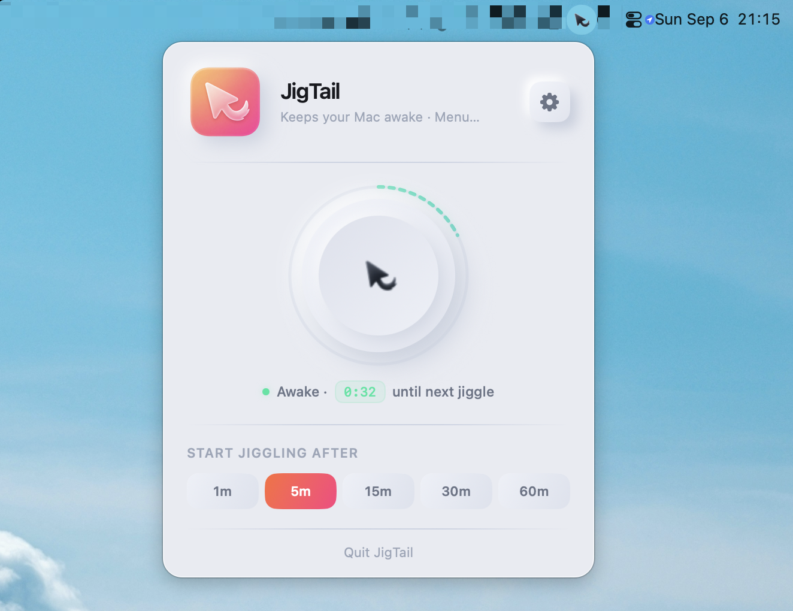

<div align="center">



# JigTail

**A small, free, native menu-bar mouse jiggler for macOS.**

Waits until you're idle, then nudges your cursor just enough to keep sleep and the
screensaver away — so a render, build, download, or backup can finish unattended.

[Download](#download) •
[Requirements](#requirements) •
[Building](#building) •
[Features](#features) •
[Permissions](#permissions--privacy) •
[Architecture](#architecture)

</div>

---

## Why

Screensavers and sleep don't know the difference between "the user walked away" and "the
user is waiting on a five-hour export." JigTail is a small, native Swift/SwiftUI menu-bar
app, with a neumorphic UI drawn from the same design language as
[PawseKeys](https://pawsekeys.app), that solves exactly that problem and nothing more:
no telemetry, no accounts, no background services beyond the one it's named for.

## Download

Grab **[JigTail.dmg](https://github.com/pcampina/jigtail/releases/latest/download/JigTail.dmg)**
from the [latest release](https://github.com/pcampina/jigtail/releases/latest) (or from
[pcampina.github.io/jigtail](https://pcampina.github.io/jigtail/)), open it, and drag JigTail
into Applications. Builds are signed with Developer ID and notarized by Apple.

## Features

- **Idle-aware jiggling** — does nothing while you're actually using your Mac. Once you've
  been idle past a configurable threshold, it starts a tiny out-and-back cursor nudge on a
  configurable interval, and stops the instant it detects real input again.
- **One-tap manual control** — a big knob in the menu-bar popover shows exactly what's
  happening (off, waiting, or actively jiggling) with a live countdown ring, and toggles the
  whole thing on or off.
- **Conditional triggers** — instead of "always jiggle once idle," gate it on real
  conditions, combined with OR logic:
  - a specific app is running (e.g. your renderer, `Transmission`, a CI runner)
  - the CPU is busy above a threshold
  - Music or Spotify is currently playing
- **Sleep prevention** — holds an `IOPMAssertion` for the duration of an active session as a
  belt-and-suspenders measure alongside the cursor jiggle itself.
- **Launch at login**, via the modern `SMAppService` API — no login-item hacks.
- **Light / dark / system theme override**, independent of your macOS-wide appearance.
- Ships as a proper `LSUIElement` menu-bar app: no Dock icon, no app switcher clutter.

## Screenshots

<p align="center">
  
  
</p>

## Requirements

- macOS 13 (Ventura) or later, Apple Silicon only
- Xcode 15+
- [XcodeGen](https://github.com/yonaskolb/XcodeGen) (`brew install xcodegen`) — the
  `.xcodeproj` is generated from [`project.yml`](project.yml), which is the source of truth
  for project structure. Don't hand-edit `JigTail.xcodeproj`.

## Building

```bash
xcodegen generate
open JigTail.xcodeproj
```

Or entirely from the command line:

```bash
xcodegen generate
xcodebuild -project JigTail.xcodeproj -scheme JigTail -configuration Debug build
xcodebuild -project JigTail.xcodeproj -scheme JigTail -configuration Debug test
```

## Releasing

Releases are cut by pushing a version tag:

```bash
git tag v0.2.0 && git push origin v0.2.0
```

[`.github/workflows/release.yml`](.github/workflows/release.yml) runs the unit tests, then
`bundle exec fastlane release_mac` ([`fastlane/Fastfile`](fastlane/Fastfile)): it pulls the
Developer ID certificate and profile from the shared `pcampina/certificates` match repo
(readonly), archives with the tag's version, notarizes and staples the app, and wraps it in a
signed, notarized `JigTail.dmg` that's published as the latest GitHub Release. The landing
page links to `releases/latest/download/JigTail.dmg`, so it picks the build up on its own.
Running the workflow manually (**Actions → Release → Run workflow**) builds the DMG as a run
artifact without publishing anything.

The workflow needs these repository secrets: `MATCH_PASSWORD`, `MATCH_GIT_PRIVATE_KEY`
(base64 of a deploy key with read access to the certificates repo), `ASC_KEY_ID`,
`ASC_ISSUER_ID`, and `ASC_PRIVATE_KEY` (an App Store Connect API key, used for notarization).

The Developer ID provisioning profile is created once, from a machine with write access to the
certificates repo, using an App Store Connect API key for the same team (the `.p8` is read from
`~/.appstoreconnect/private_keys/AuthKey_<KEY_ID>.p8` unless `key_path:` says otherwise):

```bash
bundle install
bundle exec fastlane sync_signing key_id:<KEY_ID> issuer_id:<ISSUER_ID>
```

## Permissions & privacy

JigTail asks for two things, both used only for the jiggle mechanism itself:

- **Accessibility** — required to synthesize the cursor movement (`CGEventPost`). JigTail
  won't turn on without it; toggling it on prompts macOS's own permission dialog.
- **Apple Events** (Music/Spotify) — only requested if you enable the "Music or Spotify is
  playing" trigger, so JigTail can ask those apps whether they're currently playing.

JigTail makes no network requests and collects no analytics. Everything it stores (idle
threshold, jiggle interval, trigger settings, theme) is local `UserDefaults`.

## Usage

1. Launch JigTail — it appears in the menu bar with no Dock icon.
2. Click the menu-bar icon to open the popover and flip the knob on.
3. Grant Accessibility access when prompted (System Settings → Privacy & Security →
   Accessibility).
4. Open **Settings** from the popover to tune the idle threshold, jiggle interval,
   conditional triggers, launch-at-login, and theme.

## Architecture

- `JiggleCoordinator` (`JigTail/State`) is the central orchestrator: it wires idle
  detection, the jiggle mechanism, sleep prevention, and (in conditional mode) the trigger
  engine together, and exposes a single state enum (`off` / `idleWaiting` /
  `activeJiggling`) that the UI renders from.
- `Services/` holds the system-facing pieces: `IdleMonitorService`, `JiggleService`
  (the actual `CGEventPost` cursor nudge), `SleepPreventionService` (`IOPMAssertion`),
  `LaunchAtLoginService` (`SMAppService`), `PermissionsService` (Accessibility), and
  `TriggerEngine` with its pluggable `Services/Triggers/*` conditions.
  `SettingsStore` (`JigTail/State`) persists user-configurable settings to `UserDefaults`.
- `Views/` (`MenuBar/`, `Settings/`) is SwiftUI, built on a small neumorphic design system
  in `DesignSystem/` (tokens + components) ported from `neurocampx-ds`.

See [`TESTING.md`](TESTING.md) for how to manually verify the system-level behavior (idle
detection, sleep prevention, the jiggle mechanism itself) that unit tests can't cover.

## License

MIT — see [`LICENSE`](LICENSE).
